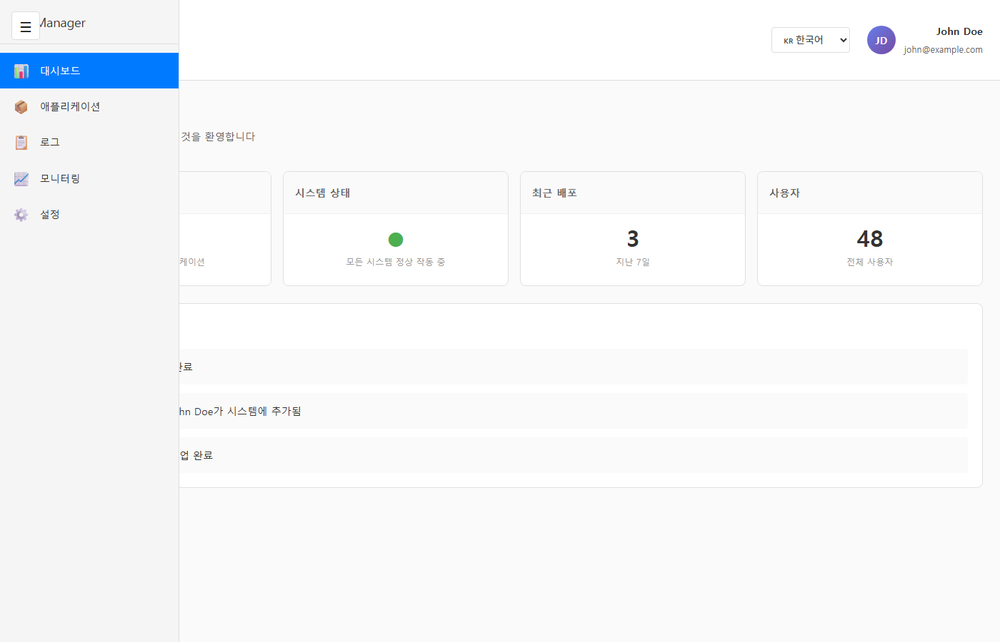
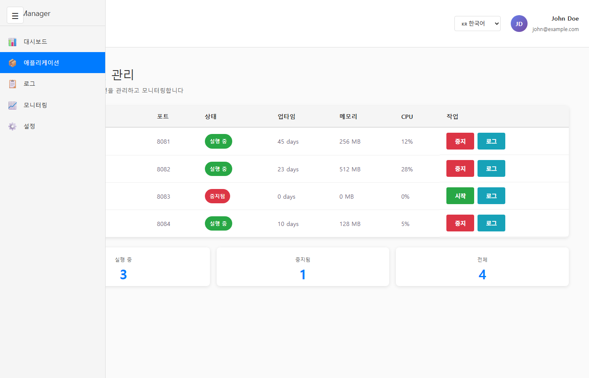
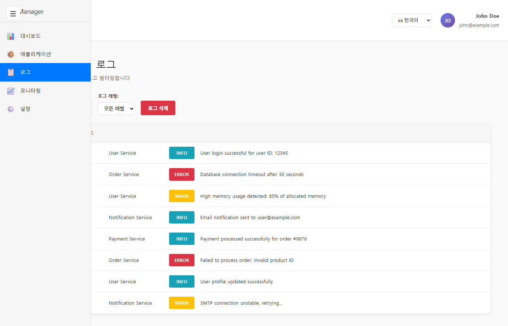
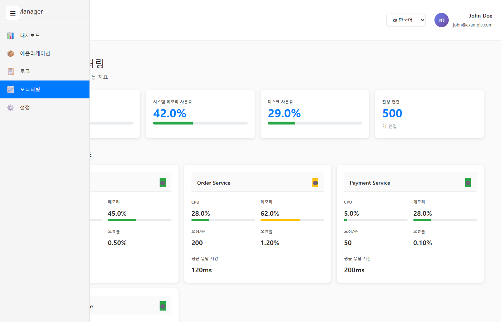
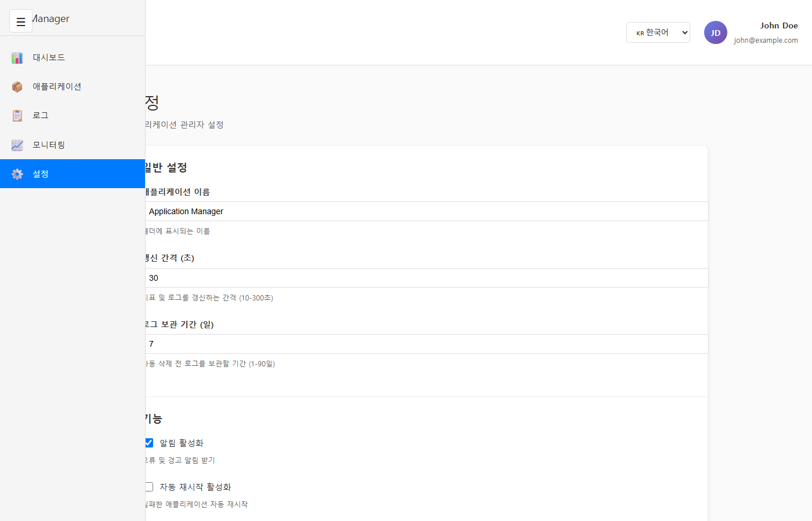

# Application Manager Web Console

**Spring Boot 애플리케이션을 관리하기 위한 전문가급 웹 기반 관리 콘솔**

Application Manager Web Console은 React와 Vite를 활용하여 Spring Boot 애플리케이션을 효율적으로 관리할 수 있는 대시보드입니다. 실시간 모니터링, 로그 분석, 애플리케이션 제어 등 다양한 기능을 제공합니다.

## 📋 프로젝트 개요

- **다국어 지원**: 영어, 한국어, 중국어 (헤더 dropdown에서 선택 가능)
- **반응형 레이아웃**: 접을 수 있는 사이드바 메뉴 + 메인 콘텐츠 영역
- **헤더**: 로그인 정보, 사용자 프로필, 언어 선택 기능
- **프론트엔드 클라이언트**: React 기반 SPA (Single Page Application)
- **백엔드**: 별도 API 서버와 통신 (모듈 준비 완료)

## 🛠️ 기술 스택

- **프론트엔드 프레임워크**: React 19.2+ (함수형 컴포넌트, Hooks)
- **번들러**: Vite 8.1+
- **언어**: JavaScript (ES6+)
- **라우팅**: React Router v6+
- **상태 관리**: Zustand
- **API 통신**: React Query (@tanstack/react-query)
- **다국어 지원**: i18next + react-i18next
- **UI 라이브러리**: Material-UI (MUI)
- **패키지 관리자**: npm
- **스타일링**: CSS (Scoped CSS)

## 📁 디렉토리 구조

```
src/
├── components/
│   ├── layout/           # 레이아웃 컴포넌트
│   │   ├── Sidebar.jsx         # 접을 수 있는 사이드바 메뉴
│   │   ├── Header.jsx          # 헤더 (사용자 정보 + 언어 선택)
│   │   └── MainLayout.jsx      # 전체 레이아웃
│   └── common/           # 재사용 가능한 공통 UI 요소
├── pages/                # 기능별 페이지
│   ├── Dashboard.jsx           # 대시보드 (시스템 요약)
│   ├── ApplicationManagement.jsx # 애플리케이션 관리
│   ├── Logs.jsx                # 로그 조회 및 필터링
│   ├── Monitoring.jsx          # 실시간 모니터링
│   └── Settings.jsx            # 설정 관리
├── locales/              # 다국어 번역 파일
│   ├── en.json          # 영어
│   ├── ko.json          # 한국어
│   └── zh.json          # 중국어 (간체)
├── services/             # 백엔드 API 통신 레이어
├── i18n.js              # i18next 설정
├── App.jsx
└── main.jsx
```

## 🚀 시작하기

### 1. 의존성 설치

```bash
npm install
```

### 2. 개발 서버 실행

```bash
npm run dev
```

개발 서버가 시작되면 브라우저에서 `http://localhost:5173` 접속

### 3. 프로덕션 빌드

```bash
npm run build
```

최적화된 프로덕션 번들이 `dist/` 디렉토리에 생성됩니다.

### 4. 코드 린트 확인

```bash
npm run lint
```

## 📸 스크린샷

### Dashboard (대시보드)


### Application Management (애플리케이션 관리)


### Logs (로그 조회)


### Monitoring (실시간 모니터링)


### Settings (설정 관리)


## 🎨 주요 기능

### 1. **Dashboard (대시보드)**
- 전체 애플리케이션 상태 요약
- 시스템 상태 표시 (정상/경고/위험)
- 최근 배포 통계
- 최근 활동 로그 실시간 업데이트

### 2. **Application Management (애플리케이션 관리)**
- 실행 중인 모든 애플리케이션 목록 조회
- 애플리케이션별 상태 표시 (실행 중/중지)
- 포트, 업타임, 메모리, CPU 정보 표시
- **시작/중지 버튼**으로 애플리케이션 제어
- 애플리케이션별 로그 접근 링크
- 요약 통계 (실행 중/중지/전체)

### 3. **Logs (로그 조회)**
- 모든 애플리케이션의 통합 로그 조회
- **필터 기능**: 애플리케이션별, 로그 레벨별 필터
- 타임스탬프, 앱 이름, 로그 레벨, 메시지 표시
- 로그 삭제 기능

### 4. **Monitoring (실시간 모니터링)**
- **시스템 전체 지표**: CPU, 메모리, 디스크 사용률
- **애플리케이션별 실시간 메트릭**:
  - CPU & 메모리 사용률 (진행 바 시각화)
  - 요청/분 (Requests per minute)
  - 에러율 (Error rate %)
  - 평균 응답시간 (ms)
- 3초마다 자동 갱신
- 건강도 상태 표시 (정상🟢/경고🟡/심각🔴)

### 5. **Settings (설정 관리)**
- **일반 설정**: 앱 이름, 갱신 간격, 로그 보관 기간 설정
- **기능 토글**: 알림, 자동 재시작, 유지보수 모드
- **위험 작업**: 로그 삭제, 설정 초기화, 설정 내보내기
- 현재 설정 JSON 미리보기

### 6. **다국어 지원** 🌍
- **3개 언어 지원**: 영어(English), 한국어(한국어), 중국어(中文)
- 헤더의 **언어 선택 dropdown**에서 즉시 변경
- 페이지 새로고침 없이 실시간 언어 변환
- 선택한 언어는 localStorage에 저장되어 다음 방문 시에도 유지

### 7. **UI/UX 특징**
- **접을 수 있는 사이드바**: 메뉴 토글 기능으로 화면 공간 최적화
- **반응형 디자인**: 모바일/태블릿/데스크톱 모두 지원
- **직관적인 네비게이션**: React Router 기반 SPA
- **시각적 피드백**: 상태별 색상 코딩 (초록/주황/빨강)
- **실시간 업데이트**: 자동 갱신 및 즉시 반영

## 📝 개발 가이드라인

### 컴포넌트 작성

- 함수형 컴포넌트 사용
- React Hooks 활용 (`useState`, `useEffect`, `useContext`)
- `useTranslation()` 훅을 사용하여 다국어 지원
- 스타일 오염 방지를 위한 스코프 스타일링

### 다국어 지원

언어별 번역은 `src/locales/` 디렉토리의 JSON 파일에서 관리합니다.

**텍스트를 추가할 때:**
1. `src/locales/en.json`, `ko.json`, `zh.json`에 모두 번역 추가
2. 컴포넌트에서 `useTranslation()` 훅 사용: `const { t } = useTranslation()`
3. 텍스트 대신 번역 키 사용: `t('common.appName')`

예시:
```jsx
const { t } = useTranslation()

return <h1>{t('dashboard.title')}</h1>
```

### 상태 관리

- UI 상태 (사이드바 토글): 로컬 state 또는 Context API
- 글로벌 상태: Zustand 활용
- 로그인 정보: Context API를 통한 전역 접근
- 언어 선택: i18n 인스턴스를 통해 자동 관리

### API 통신

- 백엔드 API 요청은 `src/services/` 디렉토리로 분리
- 컴포넌트 내부에 직접적인 fetch/axios 호출 지양
- React Query를 활용한 효율적인 데이터 페칭 및 캐싱
- 현재는 모의 데이터(Mock Data)로 구현되어 있음

## 📦 빌드 및 배포

### 프로덕션 빌드

```bash
npm run build
```

### 빌드 결과물 확인

```bash
npm run preview
```

빌드된 파일을 로컬에서 프리뷰합니다.

## 🔗 백엔드 API 연동

이 프로젝트는 별도의 **Spring Boot 백엔드 API 서버**와 통신하도록 설계되었습니다.

### 현재 상태
- ✅ 프론트엔드 UI/UX 완성
- ✅ 라우팅 및 페이지 구조 구성
- ✅ 다국어 지원 완료
- 🔄 백엔드 API 대기 중 (Mock 데이터로 테스트 가능)

### 백엔드 연동 예정 API 엔드포인트

| 기능 | HTTP Method | 엔드포인트 |
|------|-------------|-----------|
| 애플리케이션 목록 조회 | GET | `/api/applications` |
| 애플리케이션 상세 조회 | GET | `/api/applications/{id}` |
| 애플리케이션 시작 | POST | `/api/applications/{id}/start` |
| 애플리케이션 중지 | POST | `/api/applications/{id}/stop` |
| 로그 조회 | GET | `/api/logs?app={appId}&level={level}` |
| 메트릭 조회 | GET | `/api/metrics/{appId}` |
| 시스템 상태 조회 | GET | `/api/system/status` |

### 환경 변수 설정

`.env` 파일을 프로젝트 루트에 생성하고 다음을 추가합니다:

```env
VITE_API_BASE_URL=http://localhost:8080/api
VITE_APP_NAME=Application Manager
```

## 🚀 배포

### Docker를 사용한 배포

```bash
# 프로덕션 빌드
npm run build

# Docker 이미지 생성 (Dockerfile이 필요함)
docker build -t appmanager:latest .

# 컨테이너 실행
docker run -p 3000:80 appmanager:latest
```

## 📄 라이선스

프로젝트에 대한 라이선스 정보는 프로젝트 루트의 LICENSE 파일을 참고하세요.

## 👤 개발자

**Application Manager Web Console 개발팀**

- 프론트엔드: React + Vite
- 다국어 지원: i18next
- 상태관리: Zustand
- UI: Material-UI

## 🐛 버그 리포트 및 기능 요청

버그를 발견하거나 새로운 기능을 제안하고 싶으신 경우, GitHub Issues를 통해 보고해주세요.

---

**마지막 업데이트**: 2026-06-25

## 📚 주요 업데이트 이력

### v1.1.0 (2026-06-25)
- ✨ 다국어 지원 추가 (영어, 한국어, 중국어)
- ✨ 5개 주요 페이지 구현 완료
- 🎨 반응형 UI 개선
- 📊 실시간 모니터링 기능 추가

### v1.0.0 (2026-06-24)
- 🎉 프로젝트 초기 릴리스
- ✨ 기본 레이아웃 및 네비게이션 구현
- 📊 대시보드 페이지 구현
